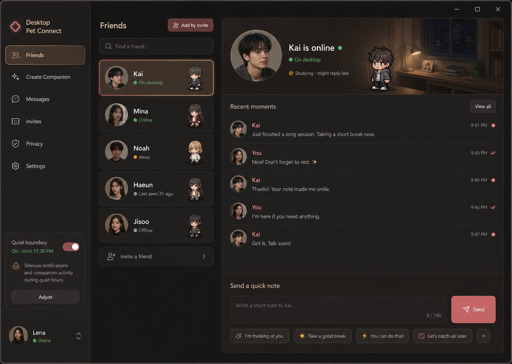

# Desktop Pet Connect 产品设计 V2：Friend Presence Hub

## 设计基线

本版本以第 2 张 gpt-image-2 原型图作为正式视觉和体验方向：

## 产品定位

Desktop Pet Connect 是一个关系型桌面陪伴产品。它的默认体验不是设置中心，也不是普通聊天软件，而是一个“朋友存在感中心”：用户能看到重要的人是否在线、TA 的桌面陪伴形象、最近来往，并用自己的桌面陪伴发出一句轻量消息。

核心场景：

- 情侣、好友或重要的人互相把对方做成桌面陪伴。
- 用户用邀请码添加对方。
- 对方在线时，消息通过桌面陪伴实时出现。
- 用户可以保持安静边界，不被打扰但不失联。

## V2 北极星体验

用户打开偏好/管理窗口时，第一眼应该看到：

1. 我有哪些重要的人在桌面上。
2. 当前选中的人是否在线。
3. 我们最近说了什么。
4. 我可以马上发一句话。
5. 我可以邀请新朋友或制作对方形象。

这比“修改一堆偏好设置”更符合朋友试用场景。

## 默认信息架构

默认导航只保留朋友会理解的入口：

- Friends：关系对象和在线存在感。
- Create Companion：把某个人做成桌面陪伴。
- Messages：完整消息记录和快速回复。
- Invites：邀请码、邀请链接、添加朋友。
- Privacy：安静边界、静默、隐藏状态。
- Settings：尺寸、置顶、透明度、行为等高级设置。

高级设置仍然存在，但不再成为第一印象。

## Friends 首页结构

### 左侧：关系列表

作用：让用户快速知道“谁在桌面上”。

内容：

- 搜索朋友。
- 添加邀请按钮。
- 朋友列表：头像/首字母、昵称、在线状态、绑定的桌面陪伴预览。
- 离线、离开、专注等状态要轻量展示。
- 底部保留安静边界和当前用户状态。

交互：

- 点击朋友切换右侧详情。
- 搜索按昵称、桌面陪伴名、关系标签过滤。
- 邀请朋友打开邀请码/输入码流程。

### 右侧顶部：选中朋友存在感

作用：让当前关系对象从“联系人”变成“桌面存在”。

内容：

- 朋友名称和在线状态。
- 当前状态说明，例如“在桌面上”“学习中，可能晚点回”。
- 绑定的桌面陪伴形象。
- 背景氛围可以使用温暖房间、桌面角落或柔和夜色，但不能抢 UI。

### 右侧中部：最近来往

作用：保留轻量上下文，而不是完整聊天压力。

内容：

- 最近 5-8 条短消息。
- 区分我和对方。
- 展示发送时间、已送达或静默。
- 不做长聊天历史，不做复杂富文本。

### 右侧底部：快速传话

作用：让用户一眼知道现在可以发一句。

内容：

- 140 字以内输入框。
- 发送按钮。
- 快捷短句。
- 字数计数。

原则：

- 短消息是产品主动作。
- 不追求替代微信或 Discord。
- 气泡来自桌面陪伴，而不是聊天窗口。

## Create Companion 结构

目标：把“制作形象”变成朋友也能完成的流程。

流程：

1. 选择这个形象代表谁。
2. 设置关系称呼。
3. 导入已有形象包，或准备 gpt-image2 提示词。
4. 预览和校验形象包。
5. 绑定到这个关系对象。

原则：

- 不展示复杂配置项。
- 不把 gpt-image2 当作展示功能，生成结果必须进入导入、校验和绑定流程。
- 禁止默认动物形象表达，除非用户主动导入。

## Invites 结构

目标：降低朋友互相添加的门槛。

内容：

- 生成邀请码。
- 复制邀请码。
- 输入对方邀请码。
- 后续扩展邀请链接和二维码。
- 显示邀请码有效期。

## Privacy 结构

目标：让用户放心保持在线。

内容：

- 全局勿扰。
- 对单个朋友静默。
- 隐藏在线状态。
- 允许/暂停接收好友来信。
- 后续增加删除好友、拉黑。

## 视觉原则

颜色：

- 背景：深中性黑，不用冷蓝。
- 主色：温柔玫瑰/珊瑚。
- 在线：鼠尾草绿。
- 提醒：柔和琥珀。
- 禁止蓝色科技风、紫色渐变、米棕大面积主题。

形态：

- 卡片圆角不超过 8px。
- 使用分组、间距、排版和细分割线建立层级。
- 避免卡片套卡片。
- 避免装饰性光球、过度渐变。

内容：

- 默认文案像朋友使用的产品，不像开发者工具。
- 不用“宠物/小动物”作为默认心智。
- “桌面陪伴”“形象”“朋友”“关系对象”优先。

## 当前实现对齐策略

短期：

- 将当前默认页重构为 Friends Hub。
- 关系列表放到默认页左侧。
- 选中朋友详情、最近来往、快速传话放到默认页右侧。
- 邀请、制作形象、消息、隐私保留真实按钮和真实数据绑定。

中期：

- 将 Invites 从高级连接页拆成默认入口。
- 将 Settings 收纳运行时设置。
- 增加删除好友、拉黑、隐藏在线状态。
- 增加 `.petpack` 导入/导出。

长期：

- 增加正式账号体系。
- 增加创作者形象包生态。
- 接入 AI，但 AI 只增强表达和生成，不抢走真实朋友连接的核心位置。

## V2 验收标准

- 新用户能在 30 秒内理解：这个产品是把真实的人放到桌面上陪伴。
- 用户能在默认页完成：选择朋友、看到状态、发送短消息、进入邀请和制作形象。
- 默认页不出现复杂高级设置。
- 视觉上温柔、精美、有商业产品感。
- 所有按钮尽量真实可用，不做静态假入口。
